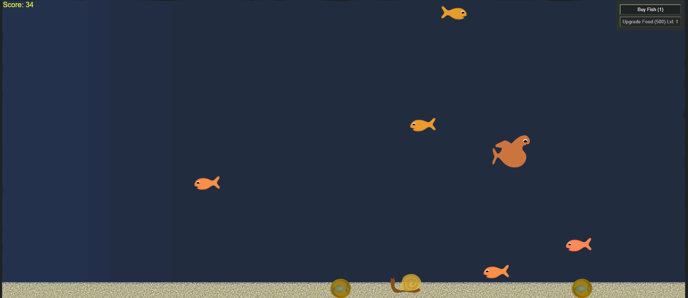

# InsaneAquarium
This is a [clone of a game](https://store.steampowered.com/app/3320/Insaniquarium_Deluxe/) from popcap which was about feeding fish and keeping them alive against bosses

# Twitch integrations
we will be integrating twitch for this

# Install
download the repo
then run your favorite npm or python server on any port
use that `localhost:PORT` to connect

### Example
`python3 -m http.server 8000`

then go to the page [localhost:8000](http://localhost:8000/)
